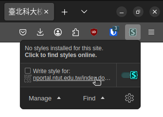
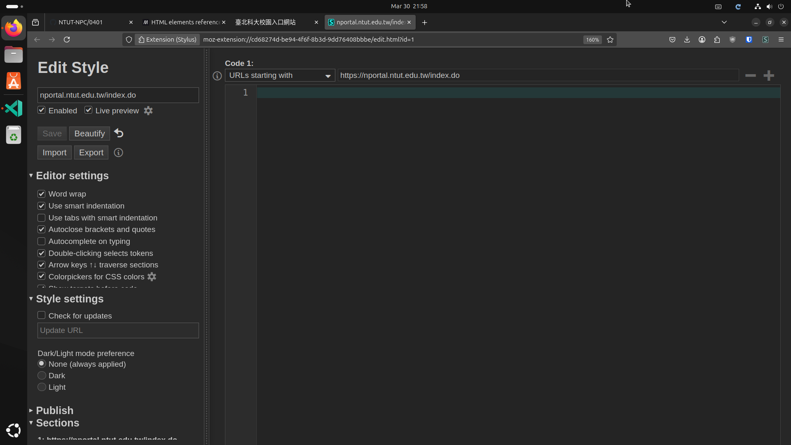
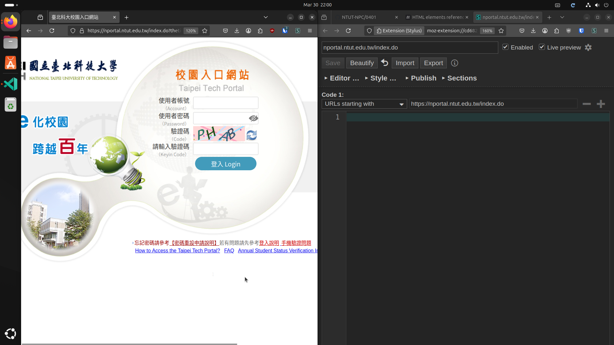
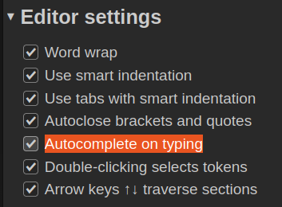
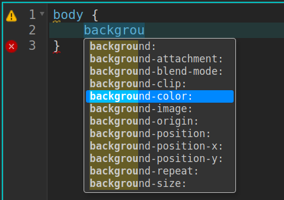
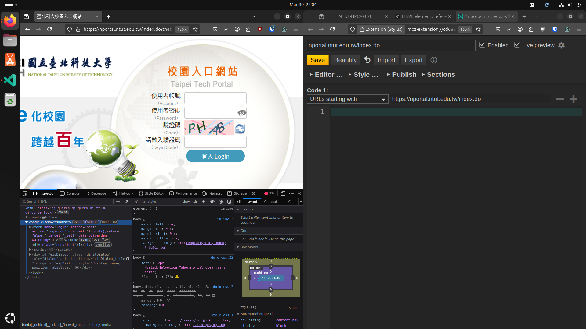
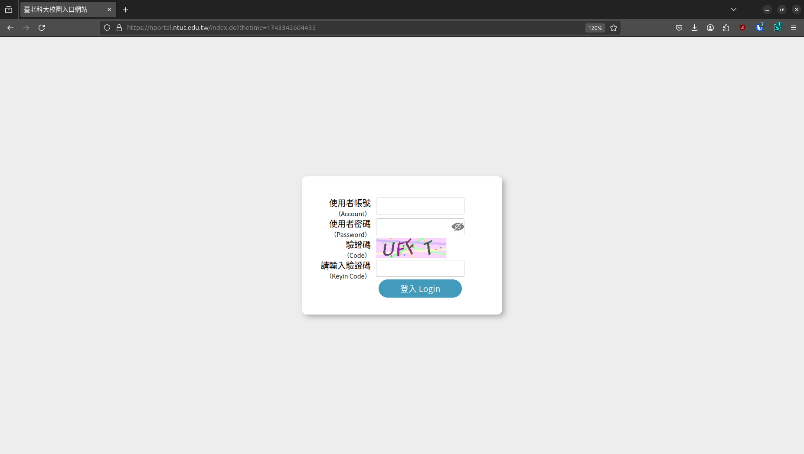

## 使用 Stylus 自訂網站樣式教學

### 前置作業

#### 安裝 Stylus

在開始之前，您需要安裝 Stylus 擴充功能。這是一個可以讓你自訂網站樣式的工具。

| 瀏覽器 | 連結 |
|---------|------|
| Google Chrome | [安裝 Stylus](https://chromewebstore.google.com/detail/stylus/clngdbkpkpeebahjckkjfobafhncgmne) |
| Mozilla Firefox | [安裝 Stylus](https://addons.mozilla.org/en-US/firefox/addon/styl-us/) |

### Playground
您可以使用以下平台來測試和編輯您的 HTML 和 CSS 代碼：

- [MDN Playground](https://developer.mozilla.org/en-US/play)
- [VSCode](https://code.visualstudio.com/)

### HTML

在使用 Stylus 之前，您需要了解一些基本的 HTML 結構。以下是一個簡單的 HTML 範例：

```html
<body>
    <h1>大標題文字</h1>
    <h2>二標題文字</h2>
    <div>
        <p>p 是 paragraph</p>
        <p>div 是區塊（division）</p>
    </div>
</body>
```

您可以參考 [MDN HTML 文件](https://developer.mozilla.org/en-US/docs/Web/HTML/Element) 以了解更多 HTML 元素。

### CSS

接下來可以使用 CSS 來自訂網站的樣式。以下是一個簡單的 CSS 範例：

```css
body {
    background-color: #f0f0f0;
    font-family: Arial, sans-serif;
}

h1 {
    color: #333;
}

p {
    color: #666;
}
```

#### CSS 結構

CSS 的基本結構如下：

```css
selector {
    property1: value;
    property2: value;
    property3: value;
}
```

#### 選擇器

選擇器用於選擇要應用樣式的 HTML 元素。您可以參考 [MDN CSS 選擇器文件](https://developer.mozilla.org/zh-TW/docs/Web/CSS/CSS_selectors) 以了解更多選擇器的用法。

### 使用 Stylus 變更校園入口樣式

1. 前往 [校園入口網站](https://nportal.ntut.edu.tw/)。
2. 點擊 Stylus 圖示，然後選擇「Write style for ...」。

   

3. 在 Stylus 編輯器中，您可以開始編寫自訂的 CSS 代碼。

   

   

### 啟用自動完成

在 Stylus 編輯器中，您可以啟用自動完成以便更方便地編寫 CSS 代碼。

|  |  |
|------------------|------------------|

### 按 F12 叫出開發人員工具

在編輯樣式時，您可以按 F12 來叫出開發人員工具，這樣可以檢查和調整您所編寫的 CSS 代碼。



### 實作範例

以下是一個簡單的範例，您可以在 Stylus 中編寫以下 CSS 來改變校園入口網站的樣式：



```css
#wrap {
	background: none;
	background-color: transparent; 
}

#slider.rslides > li > img {
	display: none
}

body {
	background: none;
	background-color: #ededed;
}

.header img {
	display: none;
}

.title {
	color: #000;
	.titleEng {
		color: #191919;
	}
}

.boxContent {
	float: none;
	height: 100dvh;
	width: 100%;
	margin: auto;
	display: flex;
	> img {
		display: none;
	}
}

.authcode a:nth-of-type(2) {
	display: none;
}

.copyright {
	display: none;
}

table {
	display: none;
}

.form {
	margin: auto;
	background-color: #fff;
	padding: 2rem	;
	box-shadow: 5px 5px 10px #b1b1b1;
	border: 1px solid #fff;
	height: auto;
}
```
